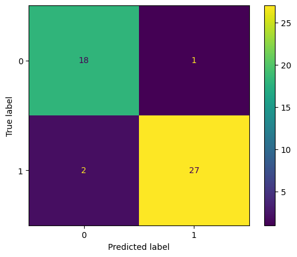

# 🧪 Classificação de Materiais em Plano Inclinado: Uma Abordagem de Data Science

## 📌 Sobre o Projeto

Este projeto aplica técnicas de **Ciência de Dados e Machine Learning** para analisar um experimento clássico de física: o rolamento de cilindros em um plano inclinado.

O objetivo principal foi desenvolver um modelo preditivo capaz de classificar o material do cilindro (**Aço** ou **Alumínio**) com base apenas nas variáveis cinemáticas (tempo de descida) e geométricas, superando as limitações da análise puramente teórica onde a massa muitas vezes é desprezada.

## ⚙️ Contexto Físico

No estudo da dinâmica de corpos rígidos, a aceleração de um objeto rolando sem deslizar é dada teoricamente por:

$$a = \frac{g \sin(\theta)}{1 + \frac{I}{mR^2}}$$

Onde $I$ é o momento de inércia. Para cilindros maciços, $I = \frac{1}{2}mR^2$, o que matematicamente cancela a massa da equação da aceleração.

**O Desafio de Dados:**
Teoricamente, cilindros de materiais diferentes (com mesma geometria) deveriam levar o mesmo tempo para descer. No entanto, dados do mundo real contêm **ruídos e variações** (atrito de rolamento, deformação do material, erro humano na cronometragem). Este projeto usa Machine Learning para detectar esses padrões sutis que a equação idealizada ignora.

---

## 🗂️ Pipeline de Dados

O projeto seguiu um fluxo de trabalho (pipeline) rigoroso de Ciência de Dados:

### 1. Coleta e Estruturação
Os dados foram coletados experimentalmente por 6 grupos diferentes, medindo:
- Massa, Diâmetro e Altura dos cilindros.
- Tempo de descida ($\Delta t$) cronometrado por múltiplos observadores.
- Geometria da rampa (comprimento $\Delta S$ e ângulo $\theta$).

### 2. Data Wrangling (Limpeza e Transformação)
Utilizando **Pandas**, os dados brutos passaram por diversas transformações:
- **Tratamento de Nulos:** Identificação de *missing values* usando mapas de calor (Heatmaps).
- **Tidy Data:** Transformação do dataset de formato "largo" (colunas por aluno) para formato "longo" (uma observação por linha) usando `pd.melt`.
- **Engenharia de Atributos:** Cálculo das velocidades médias experimentais.

## 📊 Análise de Resultados

### 1. Exploração dos Dados
A análise inicial revelou que a distinção entre os materiais não é trivial apenas olhando para os tempos brutos, devido à variância experimental entre os grupos.

*Figura 1: Variabilidade das medições de tempo entre os diferentes alunosde um mesmo grupo de coleta.*

### 2. Performance do Modelo (Regressão Logística)
O modelo foi avaliado utilizando dados de teste (30% do dataset). Abaixo, a Matriz de Confusão ilustra os acertos e erros por classe:

**Métricas Detalhadas:**

| Classe | Precision | Recall | F1-Score |
| :--- | :---: | :---: | :---: |
| **Aço (0)** | 0.64 | 0.58 | 0.61 |
| **Alumínio (1)** | 0.62 | 0.67 | 0.64 |
| **Acurácia Total** | | | **62%** |

> *Nota: A performance moderada (62%) no Grupo 1 reflete a presença de ruído nas medições manuais. Em grupos com coleta mais rigorosa (ex: Grupo 6), o mesmo pipeline atingiu >90% de acurácia, demonstrando a importância da qualidade dos dados na física experimental.*

